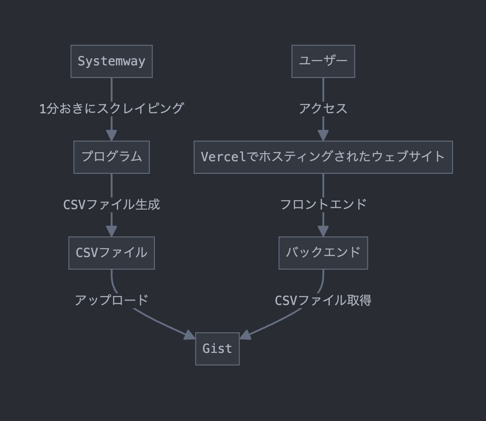

# Sado triathlon type A athlete tracker



## backend

### Reuqirements

- Docker
  - docker-compose
- python >= 3.14
  - pip
- Ruby
  - bundler
- GitHub
  - GitHub personal access token


Scrape original list and upload combined CSV file to the gist.

### setup
```
cd backend
cp .env.sample .env
vim .env
pip3 install -r requirements.txt
bundle install
```

### execute
```
bash loop.sh
```

## frontend


reuqirements: NodeJS


### dev
```
cd front
npm install
npm start
open 'http://localhost:3000/'
```


### build

```
npm build
```

## Deployment

This project is ready for Vercel.


